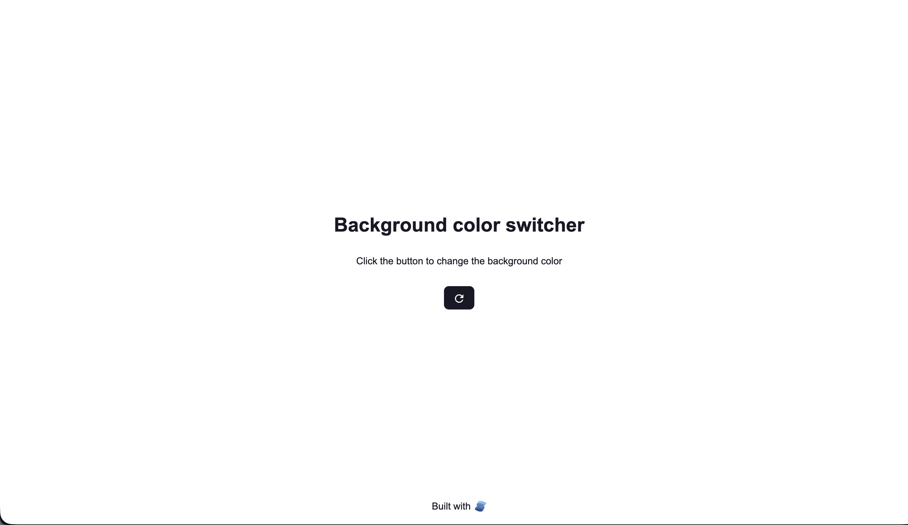
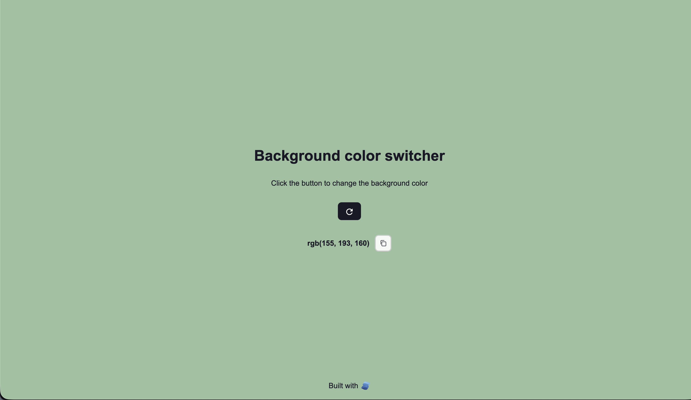

# Background Color Switcher

Click the switch button to generate a random RGB background color. The interface will smoothly transition to the new color using SolidJS's reactive signals for instant UI updates.




## Features

1. **Dynamic background color** – Updates the application background with a random RGB color on button click.
2. **Color code display** – Shows the current RGB value for easy copying and reuse.

## Tech Stack

| Layer           | Tools                               |
| --------------- | ----------------------------------- |
| Package manager | [pnpm](https://pnpm.io/)            |
| Bundler         | [Vite](https://vitejs.dev/)         |
| Library         | [SolidJS](https://www.solidjs.com/) |
| Styling         | CSS Modules                         |

## How It Works

The interface is driven by a Solid signal that captures the active RGB value:

```jsx
const [backgroundColor, setBackgroundColor] = createSignal('');

const switchBackgroundColor = () => {
  const random = () => Math.floor(Math.random() * 256);
  setBackgroundColor(`rgb(${random()}, ${random()}, ${random()})`);
};
```

Whenever `setBackgroundColor` updates the signal, each component that reads `backgroundColor()` automatically re-renders with the new color.

## Quick Start

### Prerequisites

- Node.js 18+
- pnpm `>=8`

### Install & Run

```bash
# install dependencies
pnpm install

# start dev server
pnpm run dev
```
